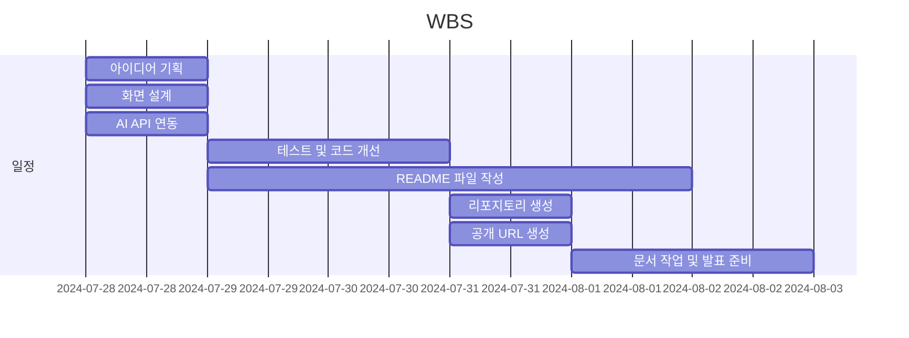
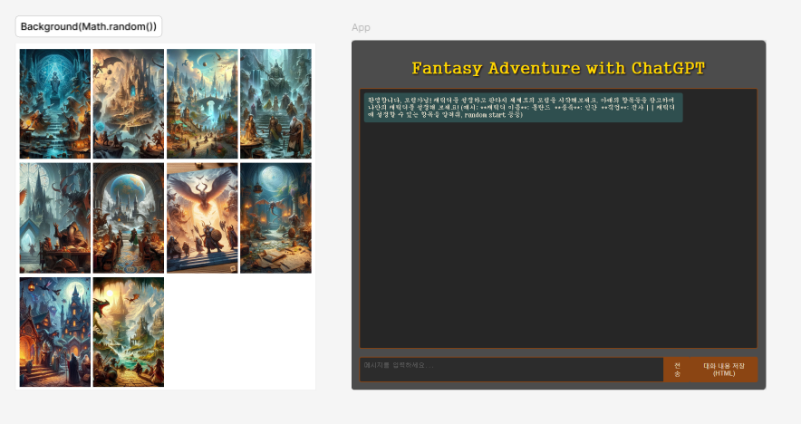

# Fantasy Adventure with ChatGPT
판타지 세계로의 모험을 즐길 수 있도록 chatGPT가 DM(던전 마스터)로서 대화를 진행해주는 챗봇 서비스입니다.
- 작성 언어 : HTML, CSS, JavaScript

## 배포 URL
[https://vanhalenpanama.github.io/FantasyAdventure-withChatGPT/](https://vanhalenpanama.github.io/FantasyAdventure-withChatGPT/)

## WBS

## Figma
[https://www.figma.com/design/xAzfDTvGdTWT1gBAc9WWhM/Fantas-Adventur-with-ChatGPT-figma](https://www.figma.com/design/xAzfDTvGdTWT1gBAc9WWhM/Fantas-Adventur-with-ChatGPT-figma)

## 기능 및 개선점
- 접속 시 배경 이미지 랜덤 출력
- 대화 내용이 길어지면 대화 창 스크롤이 자동으로 내려가도록 수정
- Enter키로 메시지 전송 및 메시지 작성 창의 커서 위치 초기화
- 메시지 작성 창에서 Shift + Enter로 메시지를 전송하지 않고 줄 바꿈이 가능하도록 수정
- 쳇봇과의 대화 내용을 HTML파일로 저장하는 기능 추가

## 개발 비화
1.컬러 코드와 Tailwind CSS 
- Tailwind CSS는 컬러 코드를 커스텀 설정해야 사용할 수 있는 방식이여서 원하는 색상 사용에 불편함을 느껴 사용을 포기

2.저작권 문제